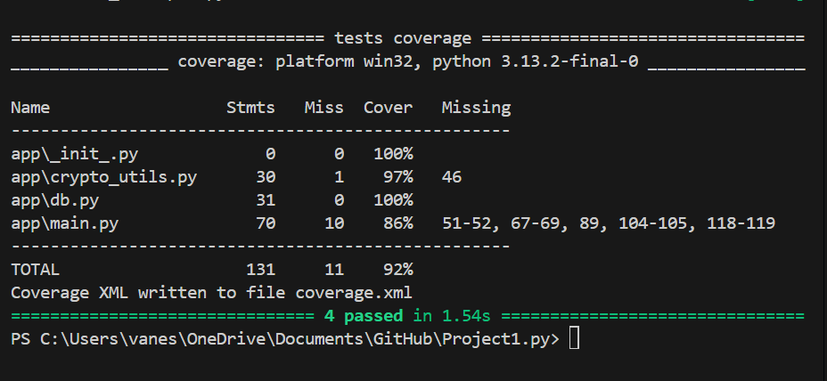
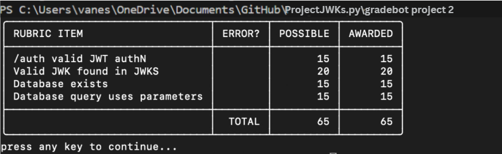

# ProjectJWKS.py

Vanessa Zuniga
Develop a RESTful JWKS server that provides public keys with unique identifiers (kid) for verifying JSON Web Tokens (JWTs), implements key expiry for enhanced security, includes an authentication endpoint, and handles the issuance of JWTs with expired keys based on a query parameter.
Key Generation
Implement RSA key pair generation.
Associate a Key ID (kid) and expiry timestamp with each key.
Web server with two handlers
Serve HTTP on port 8080
A RESTful JWKS endpoint that serves the public keys in JWKS format.
Only serve keys that have not expired.
A /auth endpoint that returns an unexpired, signed JWT on a POST request.
If the “expired” query parameter is present, issue a JWT signed with the expired key pair and the expired expiry.
Documentation
Code should be organized.
Code should be commented where needed.
Code should be linted per your language/framework.
Tests
Test suite for your given language/framework with tests for you.
Test coverage should be over 80%.

Screenshots:

Running: (beofre I deleted my project, I ran these)

Gradebots:

